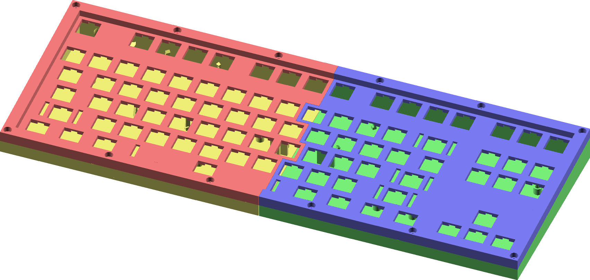

# kb3 - OpenSCAD 3D printable keyboard with TKL layout

I was inspired by [the SiCK-68 keyboard on thingiverse](https://www.thingiverse.com/thing:3478494), but I favor the tenkeyless layout.
In particular, switching between the SiCK-68 and a TKL is difficult because of the compromise in placement of the escape key.
I realized that with a similar "two halves" design, I could print a full tenkeyless layout on my printer, but just barely.
That's when I started my own 3d printable keyboard design in OpenSCAD.

# Mechanicals

Aperture sizes are taken from direct measurements, from mechanical drawings of Cherry MX and Kailh keyswitches, and from the excellent (if somewhat bitrotted) [kad](https://github.com/swill/kad) program.
The stabilizer openings are for "Keystar" style stabilizers.

In contrast to SiCK-68, the case halves are joined with M3 screws into heat-set inserts.
Internal electronics are mounted via threaded inserts or little brackets, as appropriate.
A [panel-mount USB connector](https://www.adafruit.com/product/3258) is used, instead of situating the main microcontroller PCB at a fixed location.

# Electronics

This isn't done yet :)
The tenkeyless layout needs about 23 I/Os for the "obvious" but inefficient matrix.
My other internal requirements are bluetooth and CircuitPython, but the nRF52840 Feather doesn't have enough I/Os.
For now I am planning to use the Feather plus a "seesaw" I/O expander board.
There is also a provision for several neopixel sticks for backlighting (but not per-key lighting)

# Software

I plan to run CircuitPython, which will mean a need for new code.
CircuitPython can do basic HID (USB and Bluetooth).
However, as far as I've discovered, there aren't any libraries on top of that to facilitate keyboard layers, etc.

# OpenSCAD structure

`cherryplate.scad` functions as a library, and `tkl.scad` creates a particular keyboard.

# Status

See the issues page for items I know need to be worked on

# Contributing

I'm not sure this is ready for contributions or even issue reports yet.  
That said, stuff that would be great to do is:
 * Refactor `cherryplate.scad` so it is a good basis for further work
 * Pull items such as alignment pin locations into `cherryplate.scad`
 * Maybe an (external, Python or such) converter from www.keyboard-layout-editor.com layouts to my internal format
 * Contribute other layouts
